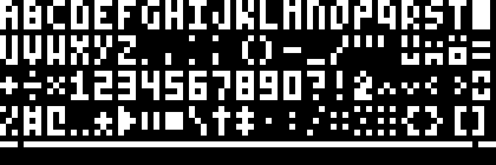

# Dots

## Overview
This project is an interactive flip dot display that allows users to input text and see it rendered in a grid of flip dots. The display is created using HTML5 canvas and JavaScript.

## Font
Part of the project is dedicated to creating a custom font that is specifically designed for the flip dot display. The font consists of 5x3 characters.

